# Self-Driving Car Engineer Nanodegree

* **Project: Advanced Lane Lines** 

* **Author:   Matt Kontz**

* **Start date:  January 29, 2019**


# Import Packages
Import package to be use throughout project notebook


```python
#importing some useful packages
import os

import glob

import matplotlib.pyplot as plt
import matplotlib.image as mpimg

import numpy as np
import cv2

%matplotlib inline
```

# Camera Calibration

## Rubric Criteria

Briefly state how you computed the camera matrix and distortion coefficients. Provide an example of a distortion corrected calibration image.

## Summary

* Create empty lists for object and image points
* Create object points once as this will be the same for all images
* Iterate through calibration images
    * load image
    * convert to grey scale
    * find corners (i.e. image points) using findChessboardCorners
    * if success append image and object points to list
* Use cv2.calibrateCamera to calculate camera calibration
    
Notice that several of the images fail to produce image points as shown in the plot below.  This appears to because some of the corners on the images that failed are not included in the image.  


```python
# Find calibration image names 
calImageNames = os.listdir("camera_cal/")

imgpoints = []
objpoints = []

objpnt = np.zeros((6*9,3), np.float32)
objpnt[:,:2] = np.mgrid[0:9,0:6].T.reshape(-1,2)

# Create figure to plot image points on calibration images
nRow = 5
nCol = 4
fig, ax = plt.subplots(nRow, nCol, figsize=(16, 14))
fig.suptitle("Image points", fontsize=16)

for k in range(len(calImageNames)):
    fname = calImageNames[k]
    
    # load a calibration image
    raw_img = mpimg.imread("./camera_cal/" + fname)
    raw_plot = plt.imshow(raw_img)

    # convert to gray scale image
    gray = cv2.cvtColor(raw_img, cv2.COLOR_BGR2GRAY)
    
    ret, corners = cv2.findChessboardCorners(gray, (9, 6), None)

    if ret:
        # if points are found then append to list of image and object points
        imgpoints.append(corners)
        objpoints.append(objpnt)
        
    c = int(k % nCol)
    r = int((k - c) / nCol)
    corner_lines_img = cv2.drawChessboardCorners(raw_img, (9, 6), corners, ret)
    ax[r,c].imshow(corner_lines_img)
    if ret:
        ax[r,c].set_title(calImageNames[k])
    else:
        ax[r,c].set_title(calImageNames[k] + ' (FAILED)')

fig.savefig('output_images/cal_image_points.png')
    
# Calculated camera calibration    
ret, mtx, dist, rvecs, tvecs = cv2.calibrateCamera(objpoints, imgpoints, gray.shape[::-1], None, None)

```


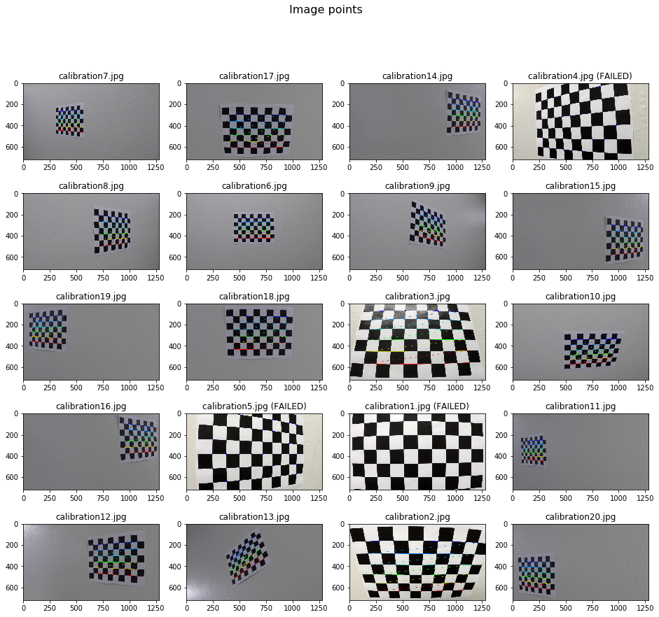


# Distortion Correction

The camera calibration calculated five parameters
 
* ret - (return value) boolean that indicates success
* mtx - (camera matrix) 
    * focal length = ( f<sub>x</sub> f<sub>y</sub> )
    * optical centers = ( c<sub>x</sub> c<sub>y</sub> )
\begin{equation*}
    mtx = \left( 
        \begin{matrix}
        f_x & 0 & c _x\\
        0 & f_y & c_y \\
        0 & 0 & 1 \\
    \end{matrix} \right)
\end{equation*}

* dist - (distortion coefficients)
\begin{equation*} 
    dist = \left[ k_1 k_2 p_1 p_2 k_3 \right] 
\end{equation*}
* rvecs - (rotation vectors) 
* tvecs - (translation vectors)

The two calibration parameters required for removing distortion are the camera martix (mtx) and distortion coefficients (dist) to produce an undistorted image.  These two parameters along with the original image are fed into cv2.undistort().  These to parameter and cv2.undistort() will be used throughout this project.  See sample below.


## Undistort function
This function takes the distorted image and returns the undistorted image.

Note tha this functions simply uses the mtx and dist parameter previously calculated.


```python
def Undistort(image):
    # undistort image
    return cv2.undistort(image, mtx, dist, None, mtx)
```

## Verify Undistortion on Sample Calibration Image
The test image is actually one of the image that failed to be added to the calibration set because not all the corners are include in the image.  There are only (9 x 5) corners instead of (9 x 6) corners.  Since this test image is straight on and zoomed in it clearly shows distortion correction because all the boxes and lines are straight in the undistorted image.

It is clear that the calibration straightens out the edge of the checker board in this image.


```python
# load and plot Sample image
fname = 'calibration1.jpg'
sample_img = mpimg.imread("./camera_cal/" + fname)
dst = Undistort(sample_img)

fig, ax = plt.subplots(1, 2, figsize=(16, 5))
fig.suptitle("Test Images: " + fname, fontsize=16)

ax[0].imshow(sample_img)
ax[0].set_title('Original')
    
ax[1].imshow(dst)
ax[1].set_title('undistorted')

fig.savefig('output_images/undistorted_chessboard.png')

```


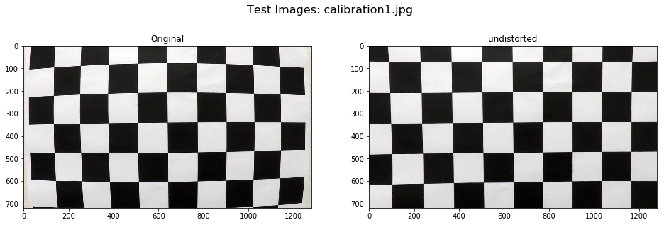


# Pipeline - Undistorted Image

## Rubric Criteria

Provide an example of a distortion-corrected image.

## Verify Undistortion on Test Image
This plot shows the undistorting a test image with the car driving down relatively straight lanes.  It is far less evident that this image is undistorted compared to the checker board image.


```python
fig, ax = plt.subplots(1, 2, figsize=(16, 5))
fig.suptitle("Test Images: " + fname, fontsize=16)

fname = 'straight_lines1.jpg'
sample_img = mpimg.imread("./test_images/" + fname)
dst = Undistort(sample_img)

ax[0].imshow(sample_img)
ax[0].set_title('Original')
    
ax[1].imshow(dst)
ax[1].set_title('undistorted')

fig.savefig('output_images/undistorted_straight_lane.png')
```


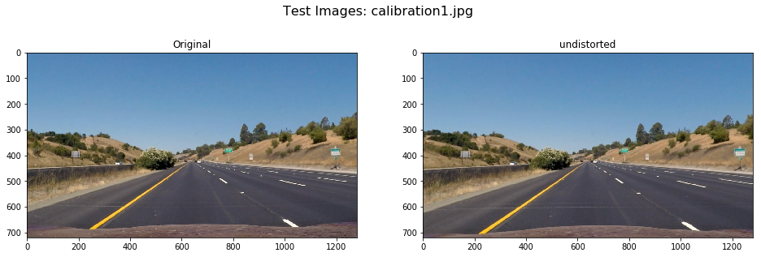


# Pipeline - Color/Gradient Threshold

## Rubric Criteria

Describe how (and identify where in your code) you used color transforms, gradients or other methods to create a thresholded binary image. Provide an example of a binary image result.

## Functions
The following three functions are used to do collar and gradient threshing to create a binary image where the 1 value roughly correspond to the lanes. 

Note: the function **ColarGradientThreshold()** which does both S-channel colar thresholding and gradient thresholding will be call through the project.


```python
# Colar thresholding using the S channel
def ColorThreshold(dst_img, s_thresh = (170, 255)):
    # convert to HLS (hue, lightness, and saturation) color space
    HLS_img = cv2.cvtColor(dst_img, cv2.COLOR_RGB2HLS)
    
    # select saturation channel
    S = HLS_img[:,:,2]
    
    binary_output = np.zeros_like(S)
    binary_output[(s_thresh[0] < S) & (S <= s_thresh[1])] = 1

    return binary_output

# Gradient thresholding applies to gray scale image
def GrayGradTheshold(dst_img, sx_thresh = (20, 200)):
    #convert to gray scale image
    gray = cv2.cvtColor(dst_img, cv2.COLOR_RGB2GRAY)
    
    # Sobel x
    sobelx = cv2.Sobel(gray, cv2.CV_64F, 1, 0) 
    abs_sobelx = np.absolute(sobelx)
    scaled_sobelx = np.uint8(255 * abs_sobelx / np.max(abs_sobelx))

    binary_output = np.zeros_like(scaled_sobelx)
    binary_output[(sx_thresh[0] < scaled_sobelx) & (scaled_sobelx <= sx_thresh[1])] = 1

    return binary_output

# Combined function with both color and graduate thresholding
def ColarGradientThreshold(dst_img, s_thresh = (170, 255), sx_thresh = (20, 255)):
    color_th_img = ColorThreshold(dst_img, s_thresh = (170, 255))   
    grad_th_img = GrayGradTheshold(dst_img, sx_thresh = (20, 200))
    
    return np.bitwise_or(color_th_img, grad_th_img)
```

## Verify and Visualize

Color and gradient thresholding applied seperately and together for 6 test images.


```python

for k in range(1,7):
    # load test image
    fname = 'test' + str(k) + '.jpg'
    raw_img = mpimg.imread('test_images/' + fname)
    
    dst = cv2.undistort(raw_img, mtx, dist, None, mtx)
    
    color_th_img = ColorThreshold(dst, s_thresh = (170, 255))
    
    grad_th_img = GrayGradTheshold(dst, sx_thresh = (20, 200))

    color_grad_im = ColarGradientThreshold(dst, s_thresh = (170, 255), sx_thresh = (20, 200)) 
    
    fig, ax = plt.subplots(2, 2, figsize=(16, 10))
    fig.suptitle(fname, fontsize=16)
    
    ax[0, 0].imshow(dst)
    ax[0, 0].set_title('Undistorted Original Image')

    ax[0, 1].imshow(color_th_img)
    ax[0, 1].set_title('S Color Threshold)')
    
    ax[1, 0].imshow(grad_th_img)
    ax[1, 0].set_title('Gray Gradient Threshold')

    ax[1, 1].imshow(color_grad_im)
    ax[1, 1].set_title('Color/gradient threshold)')
    
    fig.savefig('output_images/Color_Gradient_' + fname[:-4] + '_out.png')
```


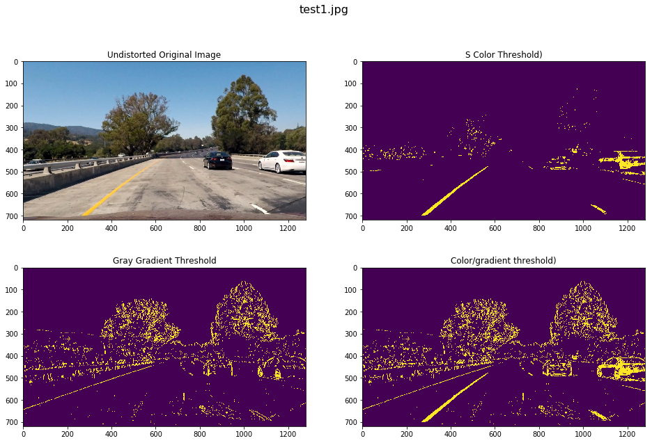


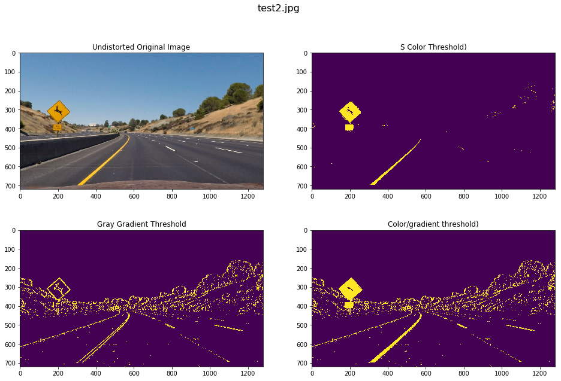


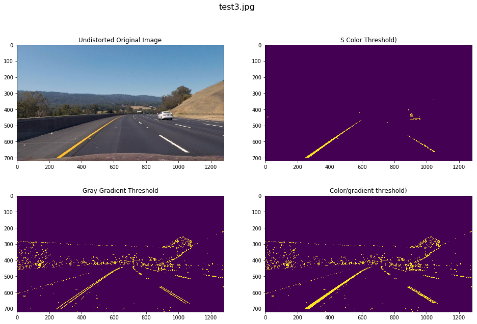


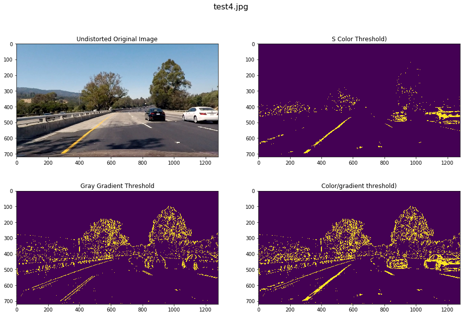


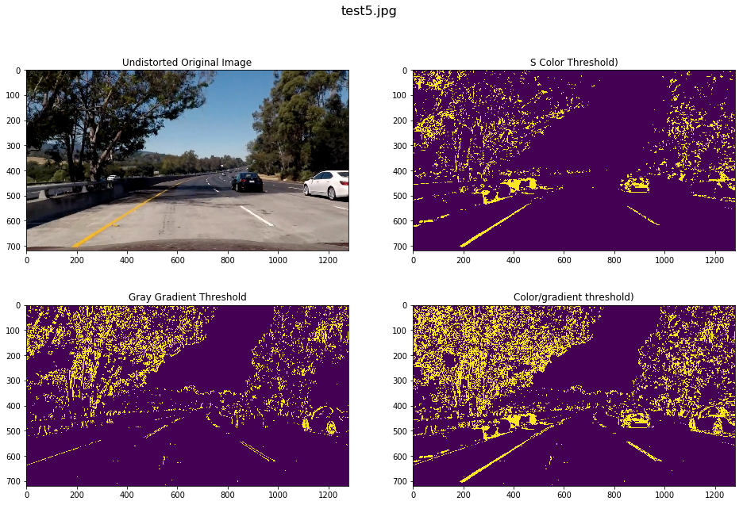


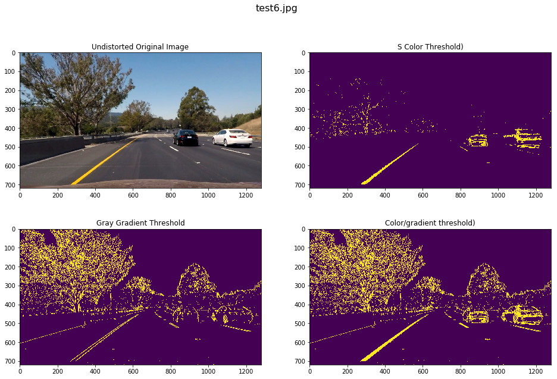


# Visualization Functions


```python
def drawPolygonLines(img, pnts, color = (50, 200, 50), thickness = 10):
    # Create black image the same size as img to draw the lines on
    poly_line_img = np.zeros((img.shape[0], img.shape[1], 3), dtype=np.uint8)
    
    cv2.polylines(poly_line_img, [pnts], False, color, thickness)
    
    return poly_line_img
    
def drawPolygonFill(img, pnts, color = (50, 200, 50)):
    # Create black image the same size as img to draw the polygon shape
    poly_fill_img = np.zeros((img.shape[0], img.shape[1], 3), dtype=np.uint8)
    
    cv2.fillPoly(poly_fill_img, np.int_([pnts]), color)
    
    return poly_fill_img

#   from Project 1
def weighted_img(img, initial_img, α=0.8, β=1., γ=0.):
    """
    `img` is the output of the hough_lines(), An image with lines drawn on it.
    Should be a blank image (all black) with lines drawn on it.
    
    `initial_img` should be the image before any processing.
    
    The result image is computed as follows:
    
    initial_img * α + img * β + γ
    NOTE: initial_img and img must be the same shape!
    """
    return cv2.addWeighted(initial_img, α, img, β, γ)
```

# Pipeline - Perspective Transform

## Rubric Criteria

Describe how (and identify where in your code) you performed a perspective transform and provide an example of a transformed image.

## Perspective Transform Function

The source points are created from the straight lane images.  Both the perspective to flat the inverse transfrom are calculated.


```python
# points in pixels defining polygon to draw on images
# s_pnts = np.array([[235, 700], [525, 500], [765, 500], [1075, 700]])
s_pnts = np.array([[235, 700], [580, 460], [705, 460], [1075, 700]])
# s_pnts = np.array([[235, 700], [610, 440], [675, 440], [1075, 700]])
src_pnts = np.float32(s_pnts)
dx_m = 3.7 # approximate lane width (m)
dy_m = 30. # approimate distance to source points (m)
dx_pix = 800.
dy_pix = 719.
x_offset = 240.
d_pnts = np.array([[x_offset, dy_pix], [x_offset, 0.], [x_offset + dx_pix, 0.], [x_offset + dx_pix, dy_pix]])
dst_pnts = np.float32(d_pnts)

# Define conversions in x and y from pixels space to meters
ym_per_pix = dy_m/dy_pix # meters per pixel in y dimension
xm_per_pix = dx_m/dx_pix # meters per pixel in x dimension


# use cv2.getPerspectiveTransform() to get M, the transform matrix
Mpersp = cv2.getPerspectiveTransform(src_pnts, dst_pnts)

# create inverse transform
Minv = cv2.getPerspectiveTransform(dst_pnts, src_pnts)

def changePerspective(image_in, M):
    # use cv2.warpPerspective() to warp your image to a top-down view
    return cv2.warpPerspective(image_in, M, image_in.shape[1::-1], flags=cv2.INTER_LINEAR)

```

## Verify and Visualize Perspective Transforms

* The first row shows the original image with the source points overlayed on the lanes
* The second row some the original image wrapped so it looks like a bird's eye view of the lane.  These images verify the perspective transform.
* The images in the third row are created by coloring in the lanes with the green fill and then using the inverse perspective transform to show the lanes in the original perspective into to verify the inverse transform.


```python
fig, ax = plt.subplots(3, 2, figsize=(16, 13))
fig.suptitle('Straight Lane Test Images', fontsize=16)

for k in range(1,3):
    # load test image
    fname = 'straight_lines' + str(k) + '.jpg'
    raw_img = mpimg.imread('test_images/' + fname)
    
    dst = Undistort(raw_img)
    # print(dst.shape)
    
    polyfill = drawPolygonFill(dst, s_pnts)
    overlay_image = weighted_img(polyfill, dst)

    flat_img = changePerspective(dst, Mpersp)
    
    polyfill_2 = drawPolygonFill(flat_img, d_pnts)
    overlay_image_2 = weighted_img(polyfill_2, flat_img)

    
    inv_img = changePerspective(overlay_image_2, Minv)

    ax[0, k-1].imshow(overlay_image)
    ax[0, k-1].set_title(fname)
    
    ax[1, k-1].imshow(flat_img)
    ax[1, k-1].set_title(fname + " (bird's eye)")
    
    ax[2, k-1].imshow(inv_img)
    ax[2, k-1].set_title(fname + " (inverse)")

fig.savefig('output_images/perspective_Transform.png')
```


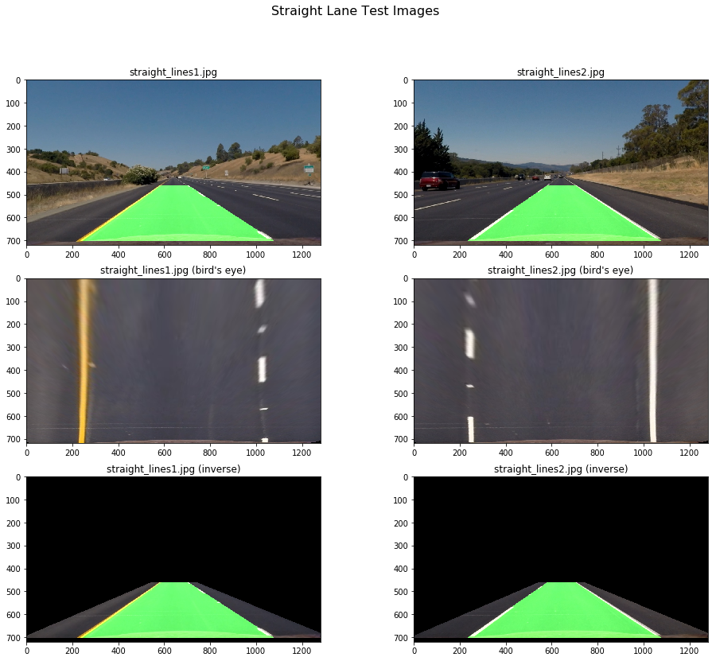


# Pipeline - Find Lane Pixels and Fit to Polynomial

## Rubric Criteria

Describe how (and identify where in your code) you identified lane-line pixels and fit their positions with a polynomial?

## Summary

The following functions are largely borrow from class material was used to identify lane pixels.  In input into these functions is a binary mapped created by applying the colar/gradient thresholidng and the perspective transform.  

* The first step of the process (**reset_lane_base()**) is to use a histogram to determine the left and right base search windows or to use the previous value.
* The next step is the **find_lane_pixels()** function that looks for lanes pixels in the window.
    * Hyperparameters - same as class example with the addition of **maxstd** which is used to eliminate windows of data with poor signal to noise.
    * **Output #1** - pixels (leftx, lefty, rightx, righty) this will be used **fit_polynomial** to fit polynomials using the np.polyfit function.  This is used by the **BasicLaneLinesPipe()**.
    * **Output #2** - left and right points (left_pnts, right_pnts) each of these points has the mean y, mean x and covariance of x for each window.  These points are design to feed into **KalmanLanes** class described later in the project.  This is used by the **KalmanLaneLinesPipe()**.

## Reset Base Location of Lanes 


```python
def reset_lane_base(binary_warped):
    # Take a histogram of the bottom half of the image
    histogram = np.sum(binary_warped[binary_warped.shape[0]//2:,:], axis=0)

    # Find the peak of the left and right halves of the histogram
    # These will be the starting point for the left and right lines
    midpoint = np.int(histogram.shape[0]//2)
    leftx_base = np.argmax(histogram[:midpoint])
    rightx_base = np.argmax(histogram[midpoint:]) + midpoint

    return leftx_base, rightx_base
```

## Finds Lane Pixels


```python
def find_lane_pixels(binary_warped, leftx_base = None, rightx_base = None):
    # HYPERPARAMETERS
    # Choose the number of sliding windows
    nwindows = 20
    # Set the width of the windows +/- margin
    margin = 100
    # Set minimum number of pixels
    minpix = 250
    # Set minimum standard deviation in number of pixels 
    maxstd = 40 # Note this is image x

    # Set height of windows - based on nwindows above and image shape
    window_height = np.int(binary_warped.shape[0]//nwindows)
    
    # Identify the x and y positions of all nonzero pixels in the image
    nonzero = binary_warped.nonzero()
    nonzeroy = np.array(nonzero[0])
    nonzerox = np.array(nonzero[1])
    
    # Image for debug
    out_img = np.dstack((binary_warped, binary_warped, binary_warped))*255
    
    # Current positions to be updated later for each window in nwindows
    if (leftx_base is None) or (rightx_base is None):
        leftx_base, rightx_base = reset_lane_base(binary_warped)
    
    leftx_current = leftx_base
    rightx_current = rightx_base

    # Create empty lists to receive left and right lane pixel indices
    left_lane_inds = []
    right_lane_inds = []

    # 2-D np.arrya to store value for Kalman filter
    left_pnts = np.empty((0,3), float)
    right_pnts = np.empty((0,3), float)
        
    # Step through the windows one by one
    for window in range(nwindows):
        # Identify window boundaries in x and y (and right and left)
        win_y_low = binary_warped.shape[0] - (window+1)*window_height
        win_y_high = binary_warped.shape[0] - window*window_height
        
        # Find the four below boundaries of the window
        win_xleft_low = leftx_current - margin
        win_xleft_high = leftx_current + margin
        win_xright_low = rightx_current - margin
        win_xright_high = rightx_current + margin
        
        # Identify the nonzero pixels in x and y within the window    
        good_left_inds = ((nonzeroy >= win_y_low) & (nonzeroy < win_y_high) & 
        (nonzerox >= win_xleft_low) &  (nonzerox < win_xleft_high)).nonzero()[0]
        
        good_right_inds = ((nonzeroy >= win_y_low) & (nonzeroy < win_y_high) & 
        (nonzerox >= win_xright_low) &  (nonzerox < win_xright_high)).nonzero()[0]
        

        # Append these indices to the lists
        if ((np.std(nonzerox[good_left_inds]) < maxstd) and (minpix < len(good_left_inds))):
        
            # Draw the windows on the visualization image
            cv2.rectangle(out_img, (win_xleft_low, win_y_low),
            (win_xleft_high, win_y_high), (0,255,0), 2)
        
            # append points for polynomial fitting
            left_lane_inds.append(good_left_inds)
        
            # calculate center point and covariance
            lefty_mean = float(np.mean(nonzeroy[good_left_inds]))
            leftx_mean = float(np.mean(nonzerox[good_left_inds]))
            leftx_cov = float(np.cov(nonzeroy[good_left_inds]))
            left_pnts = np.concatenate((left_pnts, np.array([[lefty_mean, leftx_mean, leftx_cov]])), axis = 0)
            
            # recenter next window on their mean position
            leftx_current = np.int(leftx_mean)          

        if ((np.std(nonzerox[good_right_inds]) < maxstd) and (minpix < len(good_right_inds))):
        
            # Draw the windows on the visualization image
            cv2.rectangle(out_img, (win_xright_low, win_y_low),
            (win_xright_high, win_y_high), (0,255,0), 2)
        
            # append points for polynomial fitting
            right_lane_inds.append(good_right_inds)
        
            # calculate center point and covariance
            righty_mean = np.mean(nonzeroy[good_right_inds])
            rightx_mean = np.mean(nonzerox[good_right_inds])

            rightx_cov = np.cov(nonzeroy[good_right_inds])
            right_pnts = np.concatenate((right_pnts, np.array([[righty_mean, rightx_mean, rightx_cov]])), axis = 0)
            
            # recenter next window on their mean position
            rightx_current = np.int(rightx_mean)
            
    try:
        # Concatenate the arrays of indices (previously was a list of lists of pixels)
        left_lane_inds = np.concatenate(left_lane_inds)
        
        # Extract line pixel positions
        leftx = nonzerox[left_lane_inds]
        lefty = nonzeroy[left_lane_inds]
    except:
        leftx = None
        lefty = None
        
        
    try:
        # Concatenate the arrays of indices (previously was a list of lists of pixels)
        right_lane_inds = np.concatenate(right_lane_inds)
        
        # Extract line pixel positions
        rightx = nonzerox[right_lane_inds]
        righty = nonzeroy[right_lane_inds]
    except:
        rightx = None
        righty = None
    
    return leftx, lefty, rightx, righty, left_pnts, right_pnts, out_img
```

## Fits Polynomial to Lane Pixels


```python
def fit_polynomial(binary_warped):
    # Find our lane pixels first
    leftx, lefty, rightx, righty, left_pnts, right_pnts, out_img = find_lane_pixels(binary_warped)

    # Generate x and y values for plotting
    ploty = np.int32(np.linspace(0, binary_warped.shape[0]-1, binary_warped.shape[0]))
    
    if (leftx is not None) and (lefty is not None):    
        # Fit a second order polynomial to each using `np.polyfit`
        left_fit = np.polyfit(lefty, leftx, 2)
        
        # Calculate x points from polynomial fit
        left_fitx = np.int32(left_fit[0]*ploty**2 + left_fit[1]*ploty + left_fit[2])
        
        ## Visualization ##
        # Colors in the left and right lane regions
        left_fit_ind = ((0 <= left_fitx) & (left_fitx < binary_warped.shape[1])).nonzero()[0]
        out_img[lefty, leftx] = [255, 0, 0]
        out_img[ploty[left_fit_ind], left_fitx[left_fit_ind]] = [0, 255, 0]
    else:
        left_fit = None
    
    if (rightx is not None) and (righty is not None):    
        # Fit a second order polynomial to each using `np.polyfit`
        right_fit = np.polyfit(righty, rightx, 2)
        
        # Calculate x points from polynomial fit
        right_fitx = np.int32(right_fit[0]*ploty**2 + right_fit[1]*ploty + right_fit[2])
        
        ## Visualization ##
        # Colors in the left and right lane regions
        right_fit_ind = ((0 <= right_fitx) & (right_fitx < binary_warped.shape[1])).nonzero()[0]
        out_img[righty, rightx] = [0, 0, 255]
        out_img[ploty[right_fit_ind], right_fitx[right_fit_ind]] = [0, 255, 0]
    else:
        right_fit = None

    return left_fit, right_fit, out_img
```

# Detect Lane Lines

## Basic Lane Detection Pipeline 
This pipeline uses:
* **Undistort()**
* **ColarGradientThreshold()**
* **changePerspective()**
* **fit_polynomial()**
 


```python
def BasicLaneLinesPipe(img):
    # undistort image
    dst_img = Undistort(img)
    
    # apply color and gradient thresholds
    color_grad_img = ColarGradientThreshold(dst_img, s_thresh = (170, 255), sx_thresh = (20, 200)) 
    
    # warp image with perspective transfrom
    binary_warped = changePerspective(color_grad_img, Mpersp)

    # fit polynomial to lines
    left_fit, right_fit, out_img_fit = fit_polynomial(binary_warped)

    return left_fit, right_fit, out_img_fit
```

## Test and Visualize Basic Pipeline


```python
for k in range(1,7):
    # load test image
    fname = 'test' + str(k) + '.jpg'
    raw_img = mpimg.imread('test_images/' + fname)
    
    left_fit, right_fit, out_img_fit = BasicLaneLinesPipe(raw_img)

    fig, ax = plt.subplots(1, 2, figsize=(16, 9))
    fig.suptitle('Test Images: ' + fname, fontsize=16)
    
    ax[0].imshow(raw_img)
    ax[0].set_title(fname)
    
    ax[1].imshow(out_img_fit)
    ax[1].set_title(fname + " (output)")
    
    fig.savefig('output_images/Basic_Pipe_' + fname[:-4] + '_out.png')
```

    /home/mkontz/miniconda3/envs/carnd-term1/lib/python3.5/site-packages/numpy/core/_methods.py:135: RuntimeWarning: Degrees of freedom <= 0 for slice
      keepdims=keepdims)
    /home/mkontz/miniconda3/envs/carnd-term1/lib/python3.5/site-packages/numpy/core/_methods.py:105: RuntimeWarning: invalid value encountered in true_divide
      arrmean, rcount, out=arrmean, casting='unsafe', subok=False)
    /home/mkontz/miniconda3/envs/carnd-term1/lib/python3.5/site-packages/numpy/core/_methods.py:127: RuntimeWarning: invalid value encountered in double_scalars
      ret = ret.dtype.type(ret / rcount)


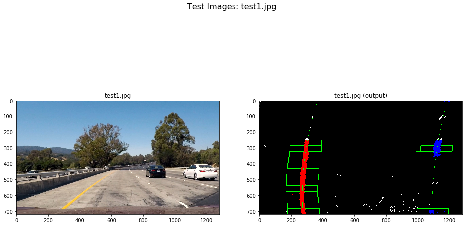


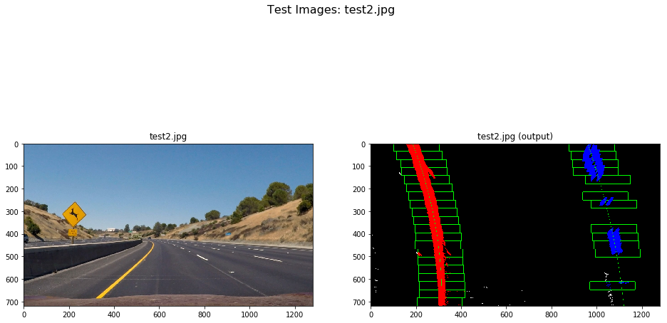


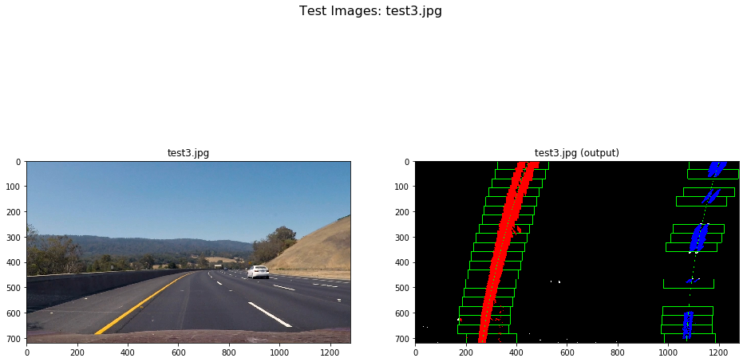


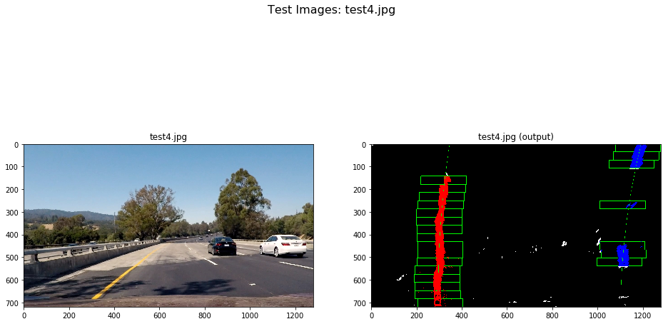


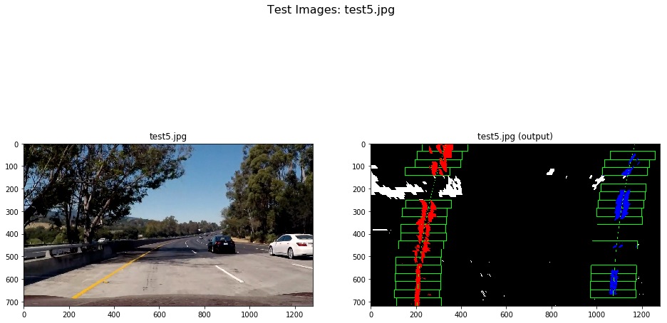


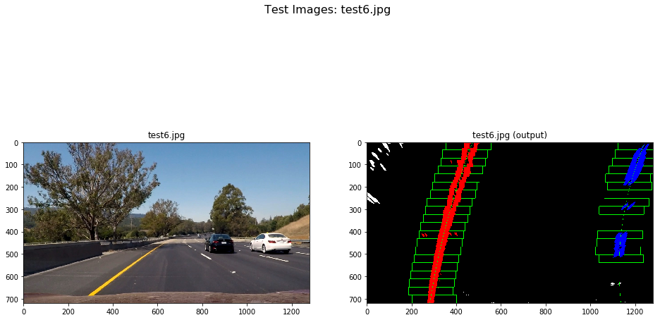


# Pipeline Lane Center and Curvature

## Rubric Criteria

Describe how (and identify where in your code) you calculated the radius of curvature of the lane and the position of the vehicle with respect to center.

## Center Summary

Calculating lane position is done by first calculating the car center in pixel from the source points fit to the straight lane images used to set the perspective transform.  The lane center in pixels is calculated using the polynomials fit tot he left and right lanes and taking the average.  The difference is then scaled to meters with the assumption that the lane is 3.7m.  See **LanePosition()**.


```python
def LanePosition(left_fit, right_fit, y = 719.):
    
    car_center = (src_pnts[3, 0] + src_pnts[0, 0]) / 2.
    
    left_pos = left_fit[0]*y**2 + left_fit[1]*y + left_fit[2]
    right_pos = right_fit[0]*y**2 + right_fit[1]*y + right_fit[2]
    lane_center = (left_pos + right_pos) / 2.

    return (car_center - lane_center) * xm_per_pix
```

## Curvature Summary
Even though, the lane lines live on the 2-D road surface, they can be described a a general function of the form

\begin{equation*}
    y = f(x) 
\end{equation*}

In other words, one variables, *y* can always be treated as dependant on *x*.  This means that curvature can be caluclated using a simplified equation.  

\begin{equation*}
    k = \frac{y''} { \left( 1 + ( y' ) ^2 \right) ^{ \frac{2}{3} } }
\end{equation*}

where

\begin{equation*}
    y' = \frac{dy}{dx}
\end{equation*}

\begin{equation*}
    y'' = \frac{d^2y}{dx^2}
\end{equation*}

Curvature is the reciprical of radius of curvature.

\begin{equation*}
    |k| = \kappa = \frac{1} { R }
\end{equation*}

where *R* is the radius of curvature.

For a quadratic equation of the form 

\begin{equation*}
    y = c_2x^2 + c_1x + c_0
\end{equation*}

like the one we are using to estimate lane lines.

\begin{equation*}
    y' = 2c_2x + c_1
\end{equation*}

\begin{equation*}
    y'' = 2c_2
\end{equation*}

Note using our image notation, that *x* and *y* are swapped compare to the trandition *x* and *y* convention used to describe curvature.

See See **calcCurvature()**.

## Change of Variable

In our image we fit the lanes in term of pixels, $y_p$ and $x_p$.

\begin{equation*}
    x_p = f(y_p)
\end{equation*}

To convert to world coordinates $y$ and $x$ that we want to use to calculate curvature the following equations can be used.

\begin{equation*}
    y = k_y \cdot x_p
\end{equation*}

\begin{equation*}
    x = k_x \cdot y_p
\end{equation*}

Therefore,

\begin{equation*}
    y = k_y \cdot f(y_p) = k_y \cdot f(x / k_y)
\end{equation*}

Taking the derivative

\begin{equation*}
    \frac{dy}{dx} = k_y \cdot \frac{dx_p}{dx} = k_y \cdot \frac{dx_p}{dy_p} \cdot \frac{\partial y_p}{\partial x} = \frac{k_y}{k_x} \cdot \frac{d}{dy_p}f(y_p)
\end{equation*}

Taking the derivative again

\begin{equation*}
    \frac{d^2y}{dx^2} = k_y \cdot \frac{d^2x_p}{dx^2} = k_y \cdot \frac{d^2x_p}{dy_p^2} \cdot \frac{\partial y_p^2}{\partial x^2} = \frac{k_y}{\left(k_x \right)^2} \cdot \frac{d^2x_p}{dy_p^2}
\end{equation*}


```python
# dimensions used from perspective transforms  
#   dx_m = 3.7 # approximate lane width (m)
#   dy_m = 30. # approimate distance to source points (m)
#   dx_px = 640.
#   dy_px = 719.  

def calcCurvature(coefficients, x = 719., kx = ym_per_pix, ky = xm_per_pix):
    # in will be assume the the coefficients are length 3 and represent a quadratic polynomial, 
    # but this could be easily extended to a polynomial of any order.
    
    yp = ky * (2 * coefficients[0] * x + coefficients[1]) / kx
    ypp = ky * (2 * coefficients[0]) / (kx ** 2.)
    
    k = ypp / ( (1 + yp ** 2) ** 1.5)
    
    return k

    
```

# Pipeline - Project Information onto Image

## Rubric Criteria

Provide an example image of your result plotted back down onto the road such that the lane area is identified clearly.

## Function Summary

The purpose of this function to to overlay the original image with:
* Overlay fill region based on left and right polynomial approximations of lanes.
* Overlay lane position text
* Overlay lcurvature and radius of curvature text


```python
def laneProjection(image, left_fit, right_fit):
    # xMax = image.shape[1] - 1
    # yMax = image.shape[0] - 1
    
    if (left_fit is not None) and (right_fit is not None):
    
        # Spread y points evening across of image at desired resolution
        pixel_res = 10
        ploty = np.int32(np.linspace(0, image.shape[0]-1, int(image.shape[0] / pixel_res)))

        # using polynomial coefficients to create left and right x values
        left_fitx = np.int32(left_fit[0]*ploty**2 + left_fit[1]*ploty + left_fit[2])
        right_fitx = np.int32(right_fit[0]*ploty**2 + right_fit[1]*ploty + right_fit[2])

        # Create a single set of points defining polygon
        left = np.array([left_fitx, ploty]).T
        right = np.array([right_fitx[::-1], ploty[::-1]]).T   
        pnts = np.concatenate((left, right), axis = 0)

        # draw polygon fill
        polyfill = drawPolygonFill(flat_img, pnts)

        # change perspective from bird-eye to original
        inv_img = changePerspective(polyfill, Minv)
        
        
        k_left = calcCurvature(left_fit)
        k_right = calcCurvature(right_fit)
        
        k = (k_left + k_right) / 2.

        font = cv2.FONT_HERSHEY_SIMPLEX
        location = (100,100)
        fontScale = 2
        fontColor = (255,255,255)
        lineType = 2
        
        location = (100,75)
        k_str = "Lane Pos. = {:.3f}m".format(LanePosition(left_fit, right_fit))
        cv2.putText(inv_img,k_str, 
            location, 
            font, 
            fontScale,
            fontColor,
            lineType)
        
        
        if (0.000001 < abs(k)):
            k_str = "Radius of Curvature = {:.0f}m".format(abs(1./k))
        else:
            k_str = "radius = ~"
        location = (100,150)
            
        cv2.putText(inv_img,k_str, 
            location, 
            font, 
            fontScale,
            fontColor,
            lineType)

        # added lane poly to image
        result = weighted_img(inv_img, image)    
    else:
        result = np.copy(image)
        
    return result
```

## Verify and Visualize


```python
for k in range(6,7):
    # load test image
    fname = 'test' + str(k) + '.jpg'
    image = mpimg.imread('test_images/' + fname)
    
    left_fit, right_fit, out_img_fit = BasicLaneLinesPipe(image)
    
    overlay_img = laneProjection(image, left_fit, right_fit)

    fig, ax = plt.subplots(2, 1, figsize=(16, 16))
    fig.suptitle('Test Images: ' + fname, fontsize=16)
    
    ax[0].imshow(overlay_img)
    ax[0].set_title(fname + ' (image with overlay)')
    
    ax[1].imshow(out_img_fit)
    ax[1].set_title(fname + " (lane finding)")
    
    fig.savefig('output_images/Lane_Pos_Curv_' + fname[:-4] + '_out.png')
```


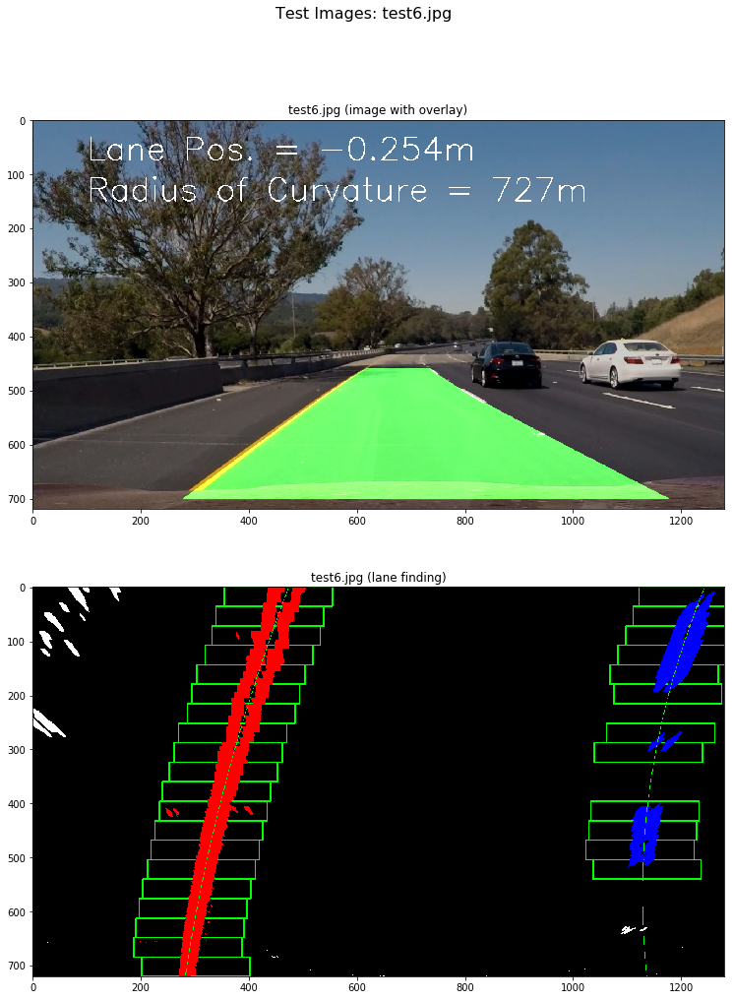


# Lane Smoothing Kalman Filter

The first three states are the polynomial coeefficient for the left lane.  The fourth state is the lane distance which adds an off set to the right lane relative to the left lane.

This approach allows information to be used over time and share information between the left and right lanes.  

The primary means to tune this filter is the state noise covariance $Q$ which corresponds to home much the lane lines are changing with time.

The fact that the shape of the left and right lanes are coupled would break down if the road was curvier, but with the sharp turn limited to about 1km in radius this is pretty good assumption.

## Kalman Filter Class


```python
class KalmanLanes:
    def __init__(self):
        self.reset()

    def reset(self):
        self.X = None

        # State update martix
        self.F = np.identity(4, dtype = np.float64)

        # Initial Covariance matrix
        self.P = np.diag(np.array([1e8, 1e8, 1e6, 1e6]))
        self.P.astype(np.float64)
        
        # State Noise Covariance martix
        self.Q = np.diag(np.array([1e1, 1e1, 1e1, 1e0]))
        self.Q.astype(np.float64)
    
    def update(self, left_pnts, right_pnts, binary_warped):
        if (self.X is None):
            # initialize state using histogram from imge
            leftx_base, rightx_base = reset_lane_base(binary_warped)
            self.X = np.matrix([0., 0., leftx_base, rightx_base - leftx_base], dtype = np.float64).reshape(4,1)
        else:
            # prediction update
            self.predition_update()
        
        # measurement update
        self.measurement_update(left_pnts, right_pnts)

        # polynomial coefficients
        # dividing by 720 to account for normalizing y inputs
        left_fit = np.array([self.X[0] / (720. ** 2), self.X[1] / 720., self.X[2]])
        right_fit = np.array([self.X[0] / (720. ** 2), self.X[1] / 720., self.X[2] + self.X[3]])
        left_fit = left_fit.reshape(3)
        right_fit = right_fit.reshape(3)
        
        return left_fit, right_fit

    def measurement_update(self, left_pnts, right_pnts):
        # H measurement matrix
        H_left = self.H_left(left_pnts[:,0])
        H_right = self.H_right(right_pnts[:,0])
        H = np.concatenate((H_left, H_right), axis = 0)
    
        # measurement covariance amtrix
        R = np.diag(np.concatenate((left_pnts[:,2], right_pnts[:,2]), axis = 0))
        R.astype(np.float64)
        
        z = np.concatenate((left_pnts[:,1], right_pnts[:,1]), axis = 0)
        z = z.reshape((z.shape[0],1))
        z.astype(np.float64)
        z_hat = np.matmul(H, self.X)

        # measurement error or residual
        e = np.subtract(z, z_hat)

        # measurement prediction covariance
        S =  np.add(np.matmul(H, np.matmul(self.P, H.T)), R)

        # Kalman gain
        K = np.matmul(self.P, np.matmul(H.T, np.linalg.inv(S)))

        # update state covariance from measurement
        self.P = np.subtract(self.P, np.matmul(K, np.matmul(S, K.T)))
        
        # update state
        self.X = np.add(self.X, np.matmul(K, e))

    def predition_update(self):
        self.X = np.matmul(self.F, self.X)
        self.P = np.add(np.matmul(self.F, np.matmul(self.P, self.F.T)), self.Q)

    def H_right(self, y):
        # H = [y^2 y 1 1]
        H = np.ones((y.shape[0], 4), dtype = np.float64)
        
        # dividing by 720 to normalize y input for numerical stability
        H[:,0] = np.multiply(y / 720., y / 720.)
        H[:,1] = y / 720.

        return H

    def H_left(self, y):
        # H = [y^2 y 1 0]
        H = self.H_right(y)
        H[:,3] = np.zeros(y.shape)

        return H 
    
```

## Kalman Pipeline

Instead of averaging, I used a Kalman filter to estimate the polynomials.

This pipe is different the the basic pipe in two ways:
* **find_lane_pixels()** is called directly, but in the basic pipel **fit_polynomial()** call this function
* **kLanes.update()** is call instead of **fit_polynomial()**


```python
kLanes = KalmanLanes()

def KalmanLaneLinesPipe(img):
    # undistort image
    dst_img = Undistort(img)
    
    # apply color and gradient thresholds
    color_grad_img = ColarGradientThreshold(dst_img, s_thresh = (170, 255), sx_thresh = (20, 200)) 
    
    # warp image with perspective transfrom
    binary_warped = changePerspective(color_grad_img, Mpersp)
    
    # Find lane points that summarize all the pixel found for the left and right lanes
    leftx, lefty, rightx, righty, left_pnts, right_pnts, out_img = find_lane_pixels(binary_warped)
    
    # Kalman filter estimate of lane polynomials
    left_fit, right_fit = kLanes.update(left_pnts, right_pnts, binary_warped)

    return left_fit, right_fit, out_img
```

## Verify and Visualize Kalman Pipeline


```python
kLanes.reset()

for k in range(6,7):
    # load test image
    fname = 'test' + str(k) + '.jpg'
    image = mpimg.imread('test_images/' + fname)
    
    for k in range(1):
        left_fit, right_fit, out_img_fit = KalmanLaneLinesPipe(image)
    
    overlay_img = laneProjection(image, left_fit, right_fit)

    fig, ax = plt.subplots(2,1, figsize=(16, 16))
    fig.suptitle('Test Images: ' + fname, fontsize=16)
    
    ax[0].imshow(overlay_img)
    ax[0].set_title(fname + ' (image with overlay)')
    
    ax[1].imshow(out_img_fit)
    ax[1].set_title(fname + " (lane finding)")
    
    fig.savefig('output_images/Kalman_pipe_' + fname[:-4] + '_out.png')
```


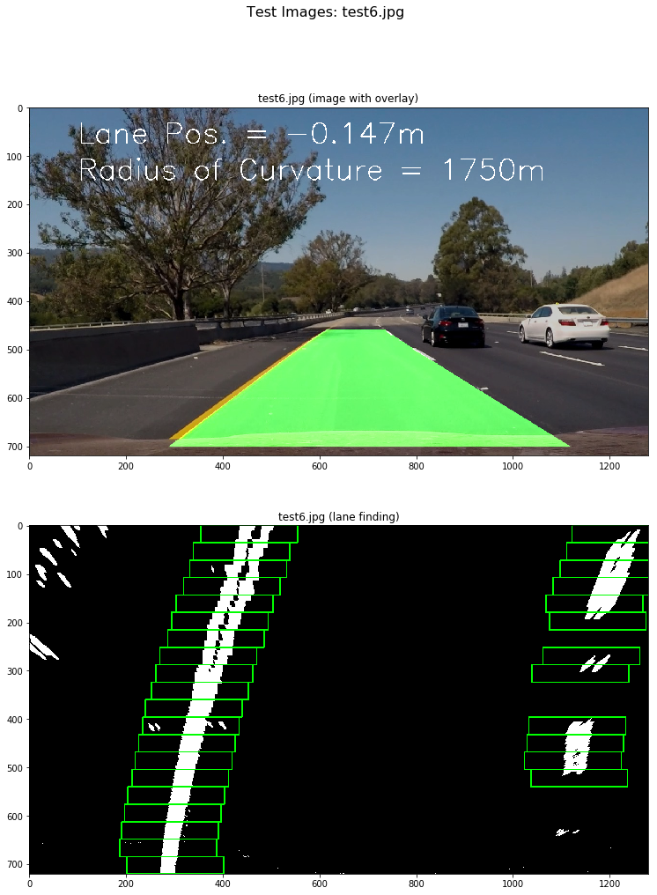


# Test on Video

Code borrowed from project #1.


```python
# Import everything needed to edit/save/watch video clips
from moviepy.editor import VideoFileClip
from IPython.display import HTML
```


```python
# reset or re initialize Kalman filter class
kLanes.reset()

def process_image(image):
    
    # fit polynomial to lines
    #left_fit, right_fit, out_img_fit = BasicLaneLinesPipe(image)
    
    # Kalman pipeline
    left_fit, right_fit, out_img_fit = KalmanLaneLinesPipe(image)
    
    # project left and right polynomials onto original image
    result = laneProjection(image, left_fit, right_fit)

    return result
```


```python
project_output = 'output_images/project_output.mp4'
clip = VideoFileClip("project_video.mp4")
adv_lane_clip = clip.fl_image(process_image) #NOTE: this function expects color images!!
%time adv_lane_clip.write_videofile(project_output, audio=False)
```

    [MoviePy] >>>> Building video output_images/project_output.mp4
    [MoviePy] Writing video output_images/project_output.mp4


    100%|█████████▉| 1260/1261 [03:31<00:00,  6.13it/s]


    [MoviePy] Done.
    [MoviePy] >>>> Video ready: output_images/project_output.mp4 
    
    CPU times: user 7min 14s, sys: 6min 17s, total: 13min 31s
    Wall time: 3min 32s


```python
HTML("""
<video width="960" height="540" controls>
  <source src="{0}">
</video>
""".format(project_output))
```


<video width="960" height="540" controls>
  <source src="output_images/project_output.mp4">
</video>


